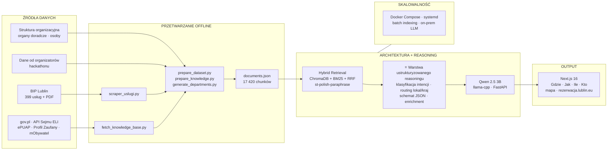

# Koziołek Antek — Asystent AI Urzędu Miasta Lublin

> **Łączymy lokalne dane urzędu z wiedzą państwową i ustrukturyzowanym reasoningiem** — obywatel dostaje konkretną odpowiedź: *gdzie, jak, ile, kto*.

Asystent RAG dla mieszkańców Lublina. Odpowiada na pytania o procedury urzędowe, korzystając z danych BIP, wzbogaconych o oficjalne źródła państwowe. Wyróżnikiem systemu jest **warstwa ustrukturyzowanego reasoningu** — zamiast luźnego tekstu zwracany jest schemat JSON mapowany na karty w interfejsie.

---

## Architektura systemu

Diagram poniżej odzwierciedla układ prezentacyjny: **dane → architektura + reasoning → output + skalowalność**.

```
┌──────────────────────────────────────────────────────────────────────────────┐
│                         KOZIOŁEK ANTEK — ASYSTENT MIEJSKI                    │
├──────────────────┬───────────────────────────────┬───────────────────────────┤
│                  │                               │  ┌─────────────────────┐  │
│  ŹRÓDŁA DANYCH   │   ARCHITEKTURA + REASONING    │  │ ODPOWIEDŹ DLA       │  │
│  (lokalne)       │   (hub systemu)               │  │ OBYWATELA           │  │
│                  │                               │  │ Gdzie│Jak│Ile│Kto    │  │
│  • BIP Lublin    │  Retrieval:                   │  │ + mapa + rezerwacja │  │
│    399 usług     │  ChromaDB + BM25 + RRF        │  └─────────────────────┘  │
│  • Struktura     │  Embeddingi PL (distilroberta)│  ┌─────────────────────┐  │
│    organizacyjna │                               │  │ SKALOWALNOŚĆ         │  │
│  • PDF-y         │  ⭐ Warstwa ustrukturyzowanego │  │ Docker · systemd     │  │
│                  │     reasoningu:                 │  │ lokalny LLM (offline)│  │
│  • gov.pl        │  intent → JSON → enrichment   │  │ pipeline etapowy     │  │
│  • API Sejmu ELI │                               │  │ bez zewn. API (prod) │  │
│  • ePUAP / PZ    │  LLM: Qwen 2.5 3B (llama-cpp) │  └─────────────────────┘  │
│                  │  API: FastAPI                   │                           │
│  → 17 420 chunków│  UI: Next.js 16 + Leaflet      │                           │
└──────────────────┴───────────────────────────────┴───────────────────────────┘
         │ scraping + fetch + chunking          structured JSON → UI cards
         └──────────────────────────────────────────────────────────────────────►
```

### Przepływ danych (Mermaid)



---

## 1. Dane

### Od urzędu miasta i organizatorów hackathonu

| Źródło | Zawartość |
|--------|-----------|
| **BIP Lublin** (`bip.lublin.eu`) | 399 kart usług — wydziały, opłaty, dokumenty, terminy, podstawa prawna |
| **Struktura organizacyjna** | Wydziały, komórki, kontakty |
| **Organy doradcze** | Rady i komisje miejskie |
| **Osoby** | Prezydent, zastępcy, pełnomocnicy |
| **Załączniki PDF** | Formularze i dokumenty z kart usług |
| **Organizatorzy hackathonu** | Kontekst projektu, wymagania, dane startowe (UrbanLab Lublin) |

Skrypty: `scraper_uslugi.py`, `bip-rag/prepare_dataset.py`, `bip-rag/generate_departments.py`

### Własne dane z oficjalnych stron urzędowych i państwowych

Dane pobierane automatycznie (`bip-rag/fetch_knowledge_base.py`, konfiguracja: `dane_bip/wiedza_bazowa/config/sources.json`):

| Źródło | Zawartość |
|--------|-----------|
| **API Sejmu (ELI)** | 8 ustaw, 293 artykuły (KPA, dowody osobiste, ewidencja ludności, PRD, opłata skarbowa…) |
| **gov.pl** | Definicje: PESEL, dowód, paszport, meldunek, e-dowód, mObywatel |
| **ePUAP** | Portal elektronicznych usług publicznych |
| **Profil Zaufany** | Uwierzytelnianie w e-administracji |
| **mObywatel** | Aplikacja mobilna obywatela |

### Unified corpus RAG

| Typ dokumentu | Chunki |
|---------------|--------|
| `pdf_attachment` | 9 284 |
| `usluga` | 7 436 |
| `wiedza_bazowa` | 339 |
| `struktura_organizacyjna` | 215 |
| `organ_doradczy` | 98 |
| `department_profile` | 26 |
| `osoba` | 22 |
| **Razem** | **17 420** |

Plik wyjściowy: `bip-rag/data/documents.json`

---

## 2. Architektura systemu

### Backend (`bip-rag/`)

| Warstwa | Technologia |
|---------|-------------|
| **API** | FastAPI + Uvicorn |
| **Embeddingi** | `sdadas/st-polish-paraphrase-from-distilroberta` (Sentence Transformers) |
| **Baza wektorowa** | ChromaDB (HNSW, cosine similarity) |
| **Retrieval rzadki** | BM25Okapi (`rank-bm25`) + tokenizacja polska |
| **Fuzja wyników** | Reciprocal Rank Fusion (RRF, k=60) |
| **LLM (produkcja)** | Qwen 2.5 3B Instruct Q4_K_M (GGUF, `llama-cpp-python`) |
| **Ekstrakcja PDF** | `pdftotext` (poppler) + PyPDF2 |
| **Scraping** | BeautifulSoup4, requests |

### Frontend (`frontend/`)

| Warstwa | Technologia |
|---------|-------------|
| **Framework** | Next.js 16 (App Router), React 19, TypeScript |
| **Styling** | Tailwind CSS 4 |
| **Mapy** | Leaflet + react-leaflet |
| **Proxy API** | `/api/query`, `/api/search`, `/api/locations` → backend |

### Algorytmy retrieval

1. **Dense search** — semantyczne podobieństwo (ChromaDB + polskie embeddingi)
2. **Sparse search** — BM25 z normalizacją polskich znaków i prefix stemming (5 znaków)
3. **RRF fusion** — łączenie rankingów dense + sparse
4. **Re-ranking** — boost tytułu, synonimów (`Szukaj też:`), routing definicji vs procedur
5. **Department anchors** — ręcznie kuratorowane profile wydziałów (`generate_departments.py`)

---

## 3. Warstwa ustrukturyzowanego reasoningu ⭐

To główne wyróżnienie systemu — nie generujemy luźnej odpowiedzi, tylko **ustrukturyzowany wynik** gotowy do UI.

### Klasyfikacja intencji

Pytanie mieszkańca jest klasyfikowane regułowo (bez dodatkowego wywołania LLM):

- **`procedure`** — „jak wyrobić”, „jakie dokumenty” → pełny pipeline JSON
- **`simple`** — „co to jest”, „kto jest”, „ile kosztuje” → krótka odpowiedź (2–4 zdania)

### Routing wiedzy (lokalna vs krajowa)

| Typ pytania | Źródło | Przykład |
|-------------|--------|----------|
| Definicja pojęcia | `wiedza_bazowa` (ustawy, gov.pl) | „Co to jest PESEL?” |
| Procedura lokalna | `usluga` (BIP Lublin) | „Jak wyrobić dowód w Lublinie?” |

Retrieval wzmacnia ten routing: boost +0.08 dla wiedzy bazowej przy pytaniach definicyjnych.

### Schemat JSON odpowiedzi

```json
{
  "summary": "...",
  "where": { "address", "room", "phone", "hours", "department", "lat", "lng" },
  "how": { "steps", "required_documents", "forms", "submission_method" },
  "how_much": { "cost", "time_estimate", "legal_basis" },
  "who": { "name", "role", "department", "gender" },
  "booking": "https://rezerwacja.lublin.eu/...",
  "additional_info": "...",
  "sources": [...]
}
```

### Post-processing (deterministyczny enrichment)

- Geokodowanie adresów Lublina (`KNOWN_LOCATIONS`)
- Inferencja linku rezerwacji (gdy wymagana wizyta osobista)
- Filtrowanie źródeł (overlap z pytaniem)
- Sugestie follow-up (`generate_suggestions`)
- Inferencja płci dla awatara „Kto”

### Mapowanie na UI

Frontend (`frontend/src/app/page.tsx`) renderuje karty:

- 📍 **Gdzie** — adres, godziny, mapa Leaflet
- 📋 **Jak** — kroki, dokumenty, formularze
- 💰 **Ile** — opłaty, terminy, podstawa prawna
- 👤 **Kto** — właściwy urzędnik / wydział
- 🔗 **Rezerwacja** — `rezerwacja.lublin.eu`

---

## 4. Skalowalność

| Cecha | Implementacja |
|-------|---------------|
| **Lokalny LLM** | Brak kosztów i zależności od chmurowych API w produkcji |
| **Offline inference** | Dane i model na serwerze urzędu |
| **Pipeline etapowy** | `fetch` → `prepare` → `index` — niezależne etapy |
| **Batch indexing** | Upsert do ChromaDB w partiach po 100 |
| **Docker Compose** | Backend :8000 + Frontend :3000 |
| **systemd** | `deploy.sh` — usługi `bip-backend`, `bip-frontend` z auto-restart |
| **Pakowanie** | `bip-rag/pack.sh` — archiwum bez venv/chroma_db |
| **Tunable retrieval** | `TOP_K`, `FINAL_K`, `N_THREADS` konfigurowalne przez env |

```
┌─────────────┐     ┌─────────────┐     ┌─────────────┐
│   FETCH     │ ──► │   PREPARE   │ ──► │    INDEX    │
│  (dane raw) │     │  (chunking) │     │  (ChromaDB) │
└─────────────┘     └─────────────┘     └─────────────┘
                                              │
                                              ▼
                                    ┌─────────────────┐
                                    │  FastAPI + LLM  │
                                    │  (on-prem)      │
                                    └─────────────────┘
```

---

## 5. Benchmarki i ewaluacja jakości

Zbudowaliśmy **zestaw 50 zapytań testowych** opracowanych we współpracy z organizatorami hackathonu (WEC). Służy do mierzenia performance systemu na realnych pytaniach mieszkańców — od prostych („gdzie jest biuro?”) po złożone („ile kosztuje rejestracja pojazdu z zagranicy?”).

### Metodologia

Ewaluacja odbywa się na **dwóch poziomach**:

| Poziom | Narzędzie | Co mierzy |
|--------|-----------|-----------|
| **Retrieval (offline)** | `benchmark_offline.py`, `benchmark_v2.py` | Trafność wyszukiwania bez LLM |
| **End-to-end (online)** | `benchmark.py` | Pełny pipeline RAG: retrieval + generacja JSON |
| **Jakość semantyczna** | **LLM-as-a-Judge** | Ocena odpowiedzi przez zewnętrzny model AI |

### LLM-as-a-Judge + zewnętrzne API

Do oceny jakości odpowiedzi (poza metrykami regułowymi) używamy **zewnętrznego modelu AI przez API** jako sędziego:

1. System generuje odpowiedź na pytanie testowe (lokalny RAG + Qwen 2.5 3B)
2. Zewnętrzny model (LLM-as-a-Judge) ocenia:
   - zgodność z ground truth z BIP / gov.pl
   - poprawność wydziału i adresu
   - kompletność pól JSON (gdzie, jak, ile, kto)
   - jakość retrieval (czy właściwe źródła trafiły do kontekstu)
3. Judge zwraca werdykt + uzasadnienie + rekomendacje usprawnień

Raport z analizy LLM-as-a-Judge: `bip-rag/benchmark_results/offline_20260613_114638/RAPORT_LLM_JUDGE.py`

> **Uwaga:** Model sędziego działa przez zewnętrzne API (np. OpenAI / Anthropic / inny provider) — jest oddzielony od modelu produkcyjnego, który działa lokalnie. Dzięki temu ewaluacja jest obiektywna i nie zależy od tego samego małego modelu, który generuje odpowiedzi.

### Metryki retrieval

| Metryka | Opis |
|---------|------|
| **Title Hit Rate** | Czy w top-6 jest właściwa karta usługi |
| **Department Hit Rate** | Czy trafiony jest właściwy wydział |
| **Content Recall** | Pokrycie słów kluczowych z ground truth |
| **Search Time** | Czas wyszukiwania (ms) |

### Zestawy pytań

| Plik | Pytań | Zakres |
|------|-------|--------|
| `bip-rag/benchmark.py` | 10 | Pełny RAG end-to-end (retrieval + generacja JSON) |
| `bip-rag/benchmark_offline.py` | 10 | Te same pytania — retrieval offline (BM25 + re-ranking) |
| `bip-rag/benchmark_v2.py` | 10 | Nowe, trudniejsze przypadki (USC, budowlanka, zasiłki…) |
| **Rozszerzony zestaw WEC** | **+30** | Dodatkowe warianty i scenariusze od organizatorów hackathonu |
| **Razem (unikalne)** | **50** | Pełny benchmark performance |

### Wyniki (po iteracjach usprawnień)

| Wersja | Title Hit | Dept Hit | Content Recall | Uwagi |
|--------|-----------|----------|----------------|-------|
| v1 offline (BM25 only) | 60% | 80% | 51.7% | Przed hybrid search i synonimami |
| **v2 offline (ulepszony)** | **100%** | **100%** | **80%** | Po synonimach, department anchors, lepszym chunkingu |

Szczegóły: `bip-rag/benchmark_results/v2_offline_20260613_122211/summary.json`

### Uruchomienie benchmarków

```bash
# Retrieval offline (bez serwera)
cd bip-rag && python3 benchmark_offline.py
cd bip-rag && python3 benchmark_v2.py

# Pełny RAG end-to-end (wymaga działającego serwera)
cd bip-rag && python3 app.py          # terminal 1
cd bip-rag && python3 benchmark.py    # terminal 2

# Raport LLM-as-a-Judge
cd bip-rag && python3 benchmark_results/offline_20260613_114638/RAPORT_LLM_JUDGE.py
```

Wyniki zapisywane są w `bip-rag/benchmark_results/` (JSON + summary per run).

---

## Struktura projektu

```
Koziołek-Antoni/
├── README.md                    # Ten plik — architektura, reasoning, benchmarki
├── docker-compose.yml           # Backend + Frontend
├── deploy.sh                    # Wdrożenie produkcyjne (systemd)
├── scraper_uslugi.py            # Scraper kart usług BIP
├── dane_bip/                    # Surowe dane
│   ├── uslugi.json              # 399 kart usług
│   └── wiedza_bazowa/           # Dane państwowe (gov.pl, ELI API)
├── bip-rag/                     # Backend RAG
│   ├── app.py                   # FastAPI — hybrid search + reasoning
│   ├── prepare_dataset.py       # Chunking dokumentów
│   ├── fetch_knowledge_base.py  # Pobieranie wiedzy państwowej
│   ├── benchmark.py             # Benchmark end-to-end
│   ├── benchmark_offline.py     # Benchmark retrieval
│   ├── benchmark_v2.py          # Benchmark v2 (trudniejsze pytania)
│   └── benchmark_results/       # Wyniki ewaluacji
└── frontend/                    # Next.js UI
    └── src/app/page.tsx         # Interfejs z kartami odpowiedzi
```

---

## Szybki start

```bash
# Backend
cd bip-rag
chmod +x setup.sh start.sh
./setup.sh
./start.sh
curl -X POST http://localhost:8000/index

# Frontend
cd frontend
npm install
npm run dev
# → http://localhost:3000

# Docker (oba serwisy)
docker compose up --build
```

Przykładowe zapytanie:

```bash
curl -X POST http://localhost:8000/query \
  -H "Content-Type: application/json" \
  -d '{"question": "Jak wyrobić dowód osobisty w Lublinie?"}'
```

---

## API

| Endpoint | Metoda | Opis |
|----------|--------|------|
| `/health` | GET | Status serwera |
| `/status` | GET | Liczba zaindeksowanych dokumentów |
| `/index` | POST | Indeksuj `data/documents.json` → ChromaDB + BM25 |
| `/query` | POST | Pytanie → structured JSON lub krótka odpowiedź |
| `/search` | POST | Tylko retrieval (bez LLM) |
| `/locations` | GET | Lokalizacje urzędu z geokodowaniem |

Szczegóły techniczne backendu: [`bip-rag/README.md`](bip-rag/README.md)

---

## Licencja i kontekst

Projekt powstał w ramach hackathonu organizowanego przez **UrbanLab Lublin** we współpracy z **Urzędem Miasta Lublin**. Dane pochodzą z publicznych źródeł (BIP, gov.pl, API Sejmu) i są przetwarzane lokalnie — bez wysyłania danych obywateli do zewnętrznych usług w trybie produkcyjnym.
